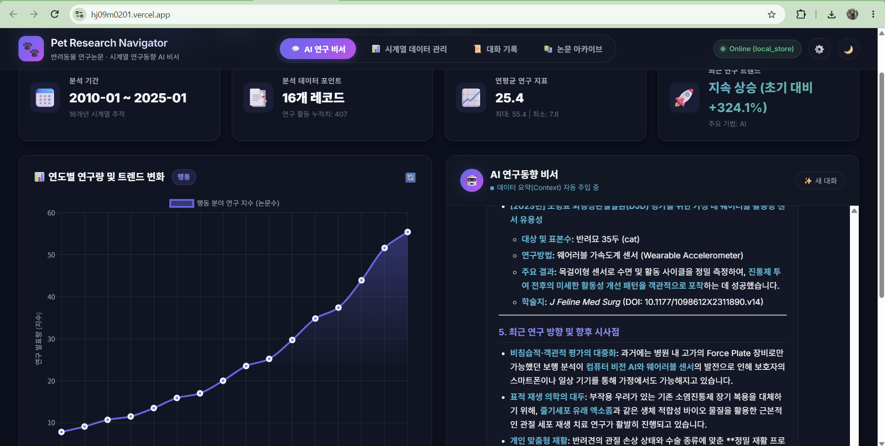
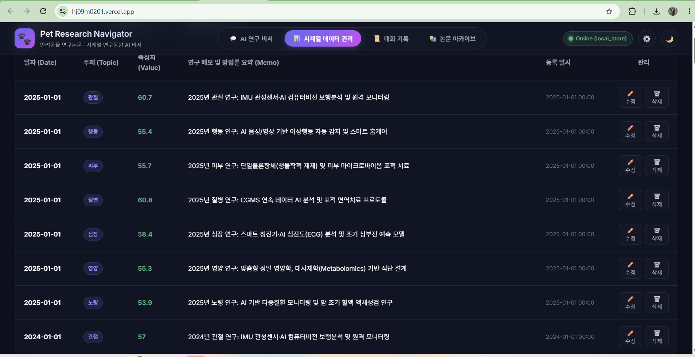
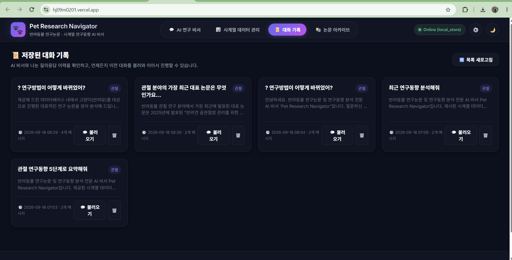

# 🐾 Pet Research Navigator (반려동물 연구동향 AI 비서)

> **데이터 기반 맞춤형 AI 비서 서비스**: 16개년 시계열 연구 데이터(112건)와 154편의 구조화된 반려동물 연구논문을 분석하고, 데이터 요약을 GPT에 실시간 컨텍스트로 주입하여 체계적인 연구동향 인사이트를 제공하는 차세대 AI 웹 애플리케이션입니다.

---

## 1. 서비스 소개 및 해결하고자 하는 문제

일반적인 범용 대형 언어 모델(ChatGPT 등)은 개별 연구자의 특화된 도메인 데이터나 시계열 축적 데이터를 알지 못하므로, "최근 반려동물 관절 연구 동향이 어때?"라고 물어보아도 상투적이거나 원론적인 답변만 제공합니다.

**Pet Research Navigator**는 이 문제를 다음과 같이 해결합니다:
1. **시계열 데이터 통계화**: 2010년부터 2025년까지 7개 연구 분야(관절, 행동, 피부, 질병, 심장, 영양, 노령)의 연구 지표와 방법론 변화를 정량적으로 추적합니다.
2. **동적 컨텍스트 주입 (Context Injection)**: 사용자가 질의를 입력하면 즉시 해당 주제의 통계 요약(`/api/data/summary`)과 관련 논문 정보를 시스템 프롬프트에 실시간 삽입합니다.
3. **5단계 표준 답변 구조화**:
   - `1. 연구현황` (기간, 레코드 수, 평균 활동량, 최근 트렌드)
   - `2. 주요 연구주제` (핵심 토픽 및 빈출 키워드)
   - `3. 연구방법 및 기술 변화` (전통 영상진단 ➔ Force plate ➔ IMU 센서·AI 컴퓨터 비전)
   - `4. 대표 논문 분석` (표본수, 연구방법, 주요 결과 정밀 요약)
   - `5. 최근 연구 방향` (병원 단회검사에서 일상생활 연속 원격 모니터링으로의 전환)
4. **시계열 데이터 CRUD 및 대화 이력 보존**: (date, value, memo, topic) 기반의 직관적인 데이터 관리와 세션별 대화 저장/불러오기를 지원합니다.

---

## 2. 시스템 아키텍처 및 데이터 흐름

```
[사용자 웹 브라우저 (Vanilla HTML/CSS/JS)]
   │
   ├── ① 연구주제 검색 / 자연어 질문 ("관절 연구동향 알려줘")
   │
   ▼
[FastAPI 백엔드 서버]
   │
   ├── ② 주제 판별 (Search Dictionary: '관절' ➔ '근골격·관절')
   │
   ├── ③ Firestore / Data Store 조회 (112개 시계열 데이터 & 154편 논문)
   │
   ├── ④ 시계열 통계 및 트렌드 계산 (/api/data/summary)
   │     └─ Period, Count, Avg/Max/Min, Trend (+284.8%), Key Methods
   │
   ├── ⑤ 시스템 프롬프트에 데이터 요약 Context 동적 주입
   │
   ├── ⑥ OpenAI GPT-4o-mini 호출 (또는 Smart Structured Fallback Engine)
   │
   ├── ⑦ 생성된 답변 및 대화 세션 자동 저장 (/api/conversations)
   │
   ▼
[사용자 화면 응답]
   └─ 5단계 구조화 분석 리포트 + 연도별 추세 인터랙티브 차트(Chart.js)
```

---

## 3. 기술 스택

| 영역 | 사용 기술 | 설명 |
| :--- | :--- | :--- |
| **Backend** | **FastAPI**, Uvicorn | 고성능 비동기 Python 웹 프레임워크 및 라우팅 |
| **Validation** | **Pydantic v2** | 엄격한 타입 검증 및 직렬화/역직렬화 스키마 |
| **Database** | **Firebase Firestore** | NoSQL 클라우드 DB (`data`, `conversations`, `papers` 컬렉션) |
| **AI Engine** | **Google Gemini API** (또는 OpenAI) | 컨텍스트 주입 기반 자연어 생성 및 분석 비서 (`gemini-1.5-flash`) |
| **Frontend** | **Vanilla HTML5, CSS3, ES6+** | 프레임워크 없는 순수 웹 표준, 글래스모피즘, 다크/라이트 모드 |
| **Visualization** | **Chart.js v4** | 연도별 논문 수 및 연구 지표 시계열 인터랙티브 차트 |
| **Deployment** | **Render** (Backend), **Vercel** (Frontend) | 클라우드 서비스 자동 빌드 및 배포 구성 |

---

## 4. 배포 URL 안내

- **프론트엔드 서비스 URL (Vercel)**: https://hj09m0201.vercel.app/
- **백엔드 API 서버 URL (Render)**: https://hj09m02-api.onrender.com
- **대화형 Swagger UI 문서**: https://hj09m02-api.onrender.com/docs

> [!TIP]
> **Render 무료 티어 슬립(콜드스타트) 대응 방안**  
> Render 무료 Web Service는 15분간 요청이 없을 경우 슬립 모드로 전환되어 첫 요청 시 약 30~50초의 지연이 발생할 수 있습니다. 본 서비스는 프론트엔드 상단에 **실시간 백엔드 연결 상태 뱃지**와 헬스체크(`/api/health`)를 연동하여 서버 기상 상태를 사용자에게 즉각 안내합니다.

---

## 5. 로컬 개발 및 실행 방법

### 1) 저장소 클론 및 가상환경 설정
```bash
# 저장소 복제
git clone git@github.com:haru2014/hj09m02.git
cd hj09m02

# Python 가상환경 생성 (Python 3.10 이상 권장)
python -m venv venv

# 가상환경 활성화 (Windows PowerShell)
.\venv\Scripts\Activate.ps1
# (macOS/Linux: source venv/bin/activate)

# 의존성 패키지 설치
pip install -r backend/requirements.txt
```

### 2) 환경 변수 설정
루트 디렉토리에 `.env` 파일을 생성하고 필요한 값을 입력합니다:
```bash
cp .env.example .env
```
*(키가 없어도 내장된 Smart Fallback & Local Storage 모드로 모든 기능이 100% 정상 구동됩니다.)*

### 3) 백엔드 통합 서버 실행
```bash
# 로컬 개발 서버 구동 (포트 8000)
uvicorn backend.main:app --reload --host 0.0.0.0 --port 8000
```
- 브라우저에서 `http://127.0.0.1:8000` 접속 시 **통합 웹 프론트엔드 UI**가 열립니다.
- `http://127.0.0.1:8000/docs` 접속 시 **Swagger API 문서**를 테스트할 수 있습니다.

### 4) 자동화 검증 테스트 실행
```bash
python test_backend.py
```
*(헬스체크, 112개 데이터 요약 통계, CRUD, 컨텍스트 주입 AI 응답, 대화 세션 자동 저장, CSV 내보내기 등 9개 항목 일괄 검증)*

---

## 6. 환경 변수 목록 (`.env`)

| 환경 변수명 | 필수 여부 | 기본값 | 설명 |
| :--- | :---: | :---: | :--- |
| `AI_PROVIDER` | 선택 | `gemini` | 사용할 AI 엔진 (`gemini`, `openai`, `auto`) |
| `GEMINI_API_KEY` | 선택 | `""` (미설정 시 스마트 템플릿 모드) | Google AI Studio에서 발급받은 Gemini API 키 |
| `GEMINI_MODEL` | 선택 | `gemini-1.5-flash` | 사용할 Gemini 모델 (`gemini-1.5-flash`, `gemini-2.0-flash` 등) |
| `OPENAI_API_KEY` | 선택 | `""` | (선택 사항) OpenAI API 인증 키 |
| `OPENAI_MODEL` | 선택 | `gpt-4o-mini` | (선택 사항) OpenAI LLM 모델 식별자 |
| `FIREBASE_SERVICE_ACCOUNT_PATH` | 선택 | `""` | 로컬 Firebase 서비스 계정 키 JSON 파일 경로 |
| `FIREBASE_SERVICE_ACCOUNT_JSON` | 선택 | `""` | 클라우드 배포 시 서비스 계정 JSON 문자열 |
| `DATA_STORE_MODE` | 선택 | `auto` | 저장소 모드 (`auto`, `firestore`, `local`) |
| `ALLOWED_ORIGINS` | 선택 | `*` | CORS 허용 도메인 목록 |
| `PORT` | 선택 | `8000` | 서버 실행 포트 |

---

## 7. 주요 API 엔드포인트 명세

### 시계열 데이터 관리 (CRUD & 요약)
- `GET /api/data`: 시계열 데이터 목록 조회 (주제별 필터링 지원, 112개 이상)
- `POST /api/data`: 새 데이터 항목 추가 `(date, value, memo, topic)`
- `GET /api/data/{id}`: 특정 데이터 항목 상세 조회
- `PUT /api/data/{id}`: 기존 데이터 수정
- `DELETE /api/data/{id}`: 데이터 삭제
- `GET /api/data/summary`: 시계열 요약 통계 생성 (기간, 개수, 평균/최대/최소, 트렌드 증감률, 연구기법)
- `GET /api/data/export`: CSV 및 JSON 다운로드 (보너스 요건 충족)

### AI 비서 및 대화 기록
- `POST /api/chat`: 데이터 요약 컨텍스트 주입 AI 질의응답 및 대화 세션 자동 저장
- `GET /api/conversations`: 저장된 대화 세션 목록 조회
- `GET /api/conversations/{id}`: 특정 대화 전체 메시지 조회 (채팅창에 재표시 및 불러오기 UX)
- `DELETE /api/conversations/{id}`: 대화 세션 삭제

### 연구논문 아카이브
- `GET /api/papers`: 154편의 구조화된 논문 목록 및 초록 검색
- `GET /api/papers/{id}`: 논문 상세 구조화 정보 조회

---

## 8. 제출 필수 화면 스크린샷 가이드

과제 제출 시 아래 화면을 캡처하여 문서에 첨부하거나 제출 자료로 활용할 수 있습니다.

### ① 데이터 요약이 보이는 채팅 화면 (질문 + 답변)

- **주요 표시 항목**: 4대 요약 카드(분석기간, 누적지수, 연평균, 최근 트렌드), 연도별 시계열 차트, AI 비서의 5단계 구조화 분석 답변(연구현황, 주제, 방법론 변화, 대표 논문, 최근 연구 방향).

### ② 시계열 데이터 관리 화면 (CRUD 동작 확인)

- **주요 표시 항목**: 112개 시계열 데이터 목록 테이블, 새 데이터 추가 모달 폼, 인라인 수정 및 삭제, CSV/JSON 내보내기 버튼.

### ③ 대화 기록 화면 (불러오기 동작 확인)

- **주요 표시 항목**: 저장된 대화 카드 목록, 첫 질문 및 토픽 뱃지, `불러오기` 버튼 클릭 시 메인 채팅창으로 과거 Q&A 메시지가 그대로 복원되는 동작.

---

## 9. 학습 및 핵심 역량 증명

1. **시계열 데이터 분석 흐름**: 원천 데이터를 시간 흐름에 따라 집계하고, 구간별 통계(평균, 최대, 최소) 및 증감률을 산출하여 거시적 연구 동향을 정량적으로 해석할 수 있습니다.
2. **컨텍스트 주입(Context Injection) 원리**: 모델 자체의 지식에 의존하지 않고, 신뢰할 수 있는 데이터베이스의 최신 요약본과 논문 초록을 동적으로 조합하여 시스템 프롬프트에 주입함으로써 할루시네이션(환각)을 원천 차단하고 도메인 특화 답변을 유도합니다.
3. **Pydantic과 계층형 아키텍처**: 요청/응답 스키마의 철저한 유효성 검증과 더불어 라우터(`api/`), 비즈니스 로직(`services/`), 데이터 계층(`data/`)을 분리하여 유지보수성과 확장성을 극대화하였습니다.
4. **보안 및 환경 격리**: API 키 및 데이터베이스 서비스 계정 정보를 코드베이스에서 완전히 배제하고 `.env` 환경 변수로 안전하게 제어합니다.
